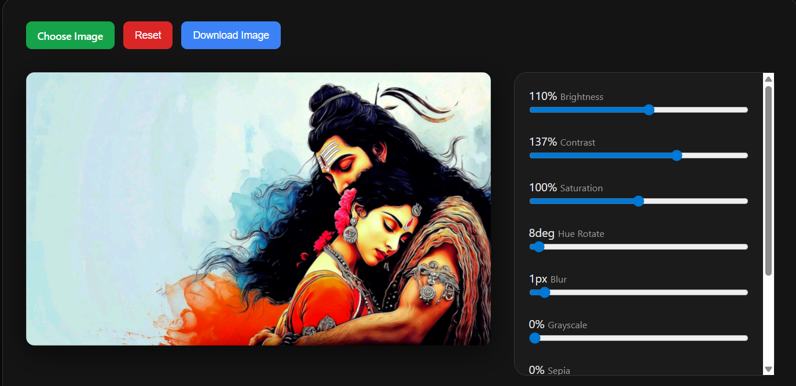

# 🎨 Image Editor Using JS

A lightweight browser-based image editor built using **HTML, CSS, and JavaScript**.  
This project allows users to upload an image, apply multiple filters in real time using sliders, and download the edited image.

---

## 🚀 Features

- 📂 Upload image from local system
- 🎛️ Real-time filter controls:
  - Brightness
  - Contrast
  - Saturation
  - Hue Rotate
  - Blur
  - Grayscale
  - Sepia
  - Opacity
  - Invert
- 🖼️ Canvas-based rendering
- 🔄 Non-destructive editing
- 💾 Download edited image
- ⚡ Dynamic slider generation using configuration object

---

## 🛠️ Technologies Used

- HTML5
- CSS3
- JavaScript (ES6)

---

## 📁 Project Structure

```
project-folder/
│
├── index.html
├── style.css
├── script.js
└── README.md
```

---

## 🧠 How It Works

1. User uploads an image.
2. Image is loaded into a Canvas element.
3. Slider values update a configuration object.
4. A dynamic filter string is generated.
5. Canvas is cleared and redrawn with updated filters.
6. Edited image can be downloaded as PNG/JPEG.

---

## 🎮 How to Use

1. Clone the repository:
   ```bash
   git clone https://github.com/DevrshShukla/Image_Editing.git
   ```

2. Open `index.html` in your browser.

3. Upload an image.

4. Adjust sliders to apply filters.

5. Click **Download Image** to save the edited version.

---

## 📸 Screenshots



---

## 💡 Future Improvements

- Undo / Redo functionality
- Image cropping tool
- Drag & Drop upload
- Before / After comparison toggle
- Dark / Light theme toggle
- Performance optimizations

---

## 📜 License

This project is open source and available under the MIT License.

---

## 👨‍💻 Author

**Devarsh Shukla**
